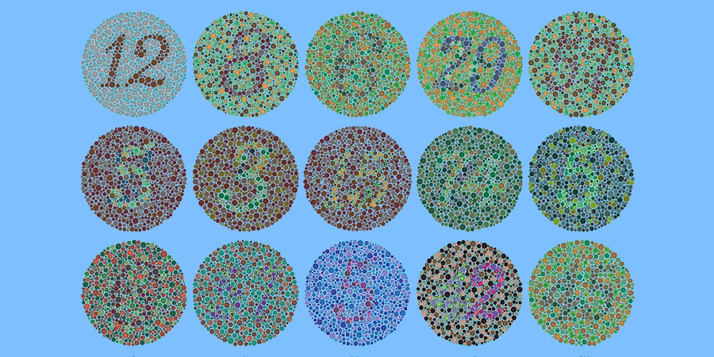
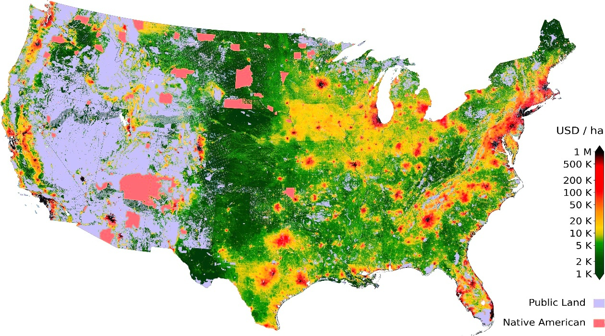

# Color-Assist
OpenCV C++ image-processing program to help boost color differentiability among those with red/green colorblindness.

## Example 1
### Input

### Output
* 50% Color boost, 0% difference threshold, square-difference green/blue decay, ignore 90% monochrome

## Example 2
### Input

### Output
* 50% Color boost, 0% difference threshold, square-difference green/blue decay, ignore 90% monochrome

