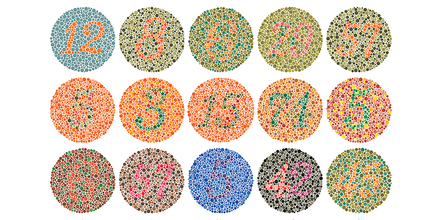
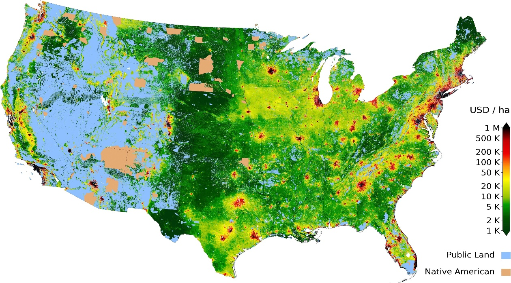

# Color-Assist
OpenCV C++ image-processing program to help boost color differentiability among those with red/green colorblindness.

## Example 1
### Input

### Output

## Example 2
### Input

### Output

